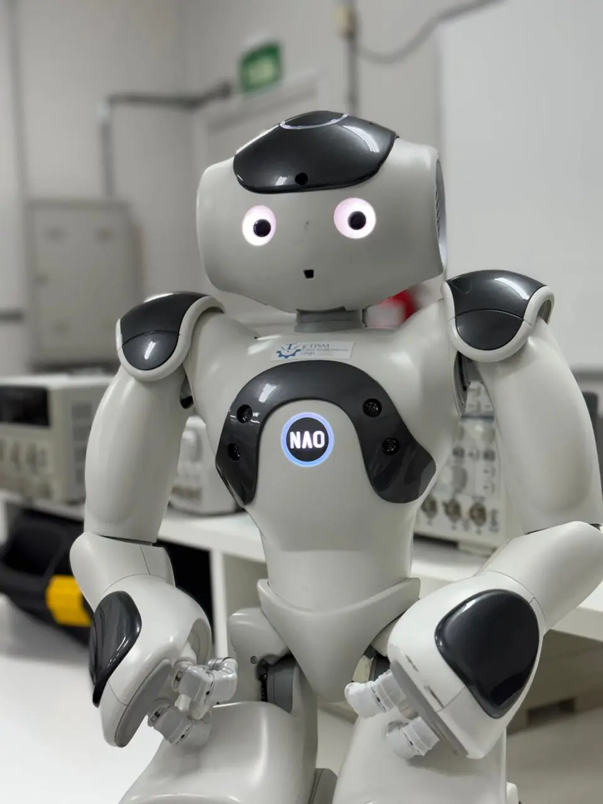

# Robô Inteligente NAO

## Sobre o projeto

Os robôs NAO, desenvolvidos originalmente pela Aldebaran Robotics e posteriormente pela SoftBank Robotics, são robôs humanoides programáveis e semiautônomos, equipados com recursos como sensores, câmeras, microfones e alto-falantes.

Este projeto foi desenvolvido durante um período de quatro meses de pesquisa como bolsista de desenvolvimento em robótica, com o objetivo de ampliar as capacidades de interação do robô **NAO V6** por meio da integração com um modelo de inteligência artificial generativa.

## Contexto

O NAO possui recursos nativos para interação com usuários, incluindo diálogos previamente programados. Entretanto, esse modelo de interação apresenta limitações quando o usuário realiza uma pergunta ou solicitação que não foi previamente definida.

Para contornar essa limitação, foi desenvolvida uma solução capaz de utilizar inteligência artificial generativa para processar perguntas de forma mais dinâmica e gerar respostas adequadas ao contexto da interação.

O modelo foi configurado para assumir a personalidade do **CTISM**, buscando proporcionar uma experiência de interação mais natural e alinhada ao ambiente em que o robô era utilizado.

## Sistema de interação

O sistema desenvolvido estabelece um fluxo entre o robô, serviços externos de processamento de áudio e um modelo de inteligência artificial generativa.

### Fluxo de interação

1. **Gravação do áudio:** o NAO captura a pergunta realizada pelo usuário.
2. **Transcrição:** o áudio é enviado para a API do Google para conversão em texto.
3. **Preparação do prompt:** o texto transcrito é utilizado para montar o prompt, juntamente com as instruções de contexto e a pergunta do usuário.
4. **Processamento:** o prompt é enviado para a API do Google Gemini para geração da resposta.
5. **Reprodução:** a resposta retornada pelo modelo é reproduzida pelo robô para o público.

Esse fluxo permitiu transformar a interação baseada exclusivamente em diálogos previamente programados em uma interação capaz de responder a perguntas não previstas anteriormente.

## Sistema de áudio

Durante o desenvolvimento, foi identificada uma limitação relacionada à qualidade dos dispositivos de áudio integrados ao NAO. A baixa qualidade do microfone e do alto-falante motivou o estudo de alternativas utilizando dispositivos externos.

Foi estudado o funcionamento do **PulseAudio** e avaliada a utilização de dispositivos externos conectados ao robô. A utilização simultânea de dispositivos Bluetooth apresentou limitações relacionadas à qualidade da conexão.

Como solução, foi utilizada a seguinte configuração:

* **JBL Charge 5:** alto-falante conectado via Bluetooth;
* **Microfone de lapela wireless:** conectado ao NAO por USB.

Também foi desenvolvido um script responsável pela configuração automática dos dispositivos de áudio durante a inicialização do robô, proporcionando uma configuração próxima de um sistema *plug and play*.

## Identificação visual

Ao final do período estipulado pela bolsa, foi iniciado o estudo e a implementação da funcionalidade nativa de identificação visual de objetos do NAO.

Essa etapa não foi concluída durante o período da pesquisa.

## Resultados

O projeto resultou na integração de um modelo de inteligência artificial generativa ao robô NAO V6, possibilitando uma interação mais dinâmica com o público por meio de um fluxo envolvendo captura de áudio, transcrição, processamento por inteligência artificial e reprodução das respostas.

Também foi desenvolvida uma solução para utilização de dispositivos de áudio externos, incluindo a configuração automática desses dispositivos durante a inicialização do robô.

## Tecnologias Utilizadas

    
    
    
    

